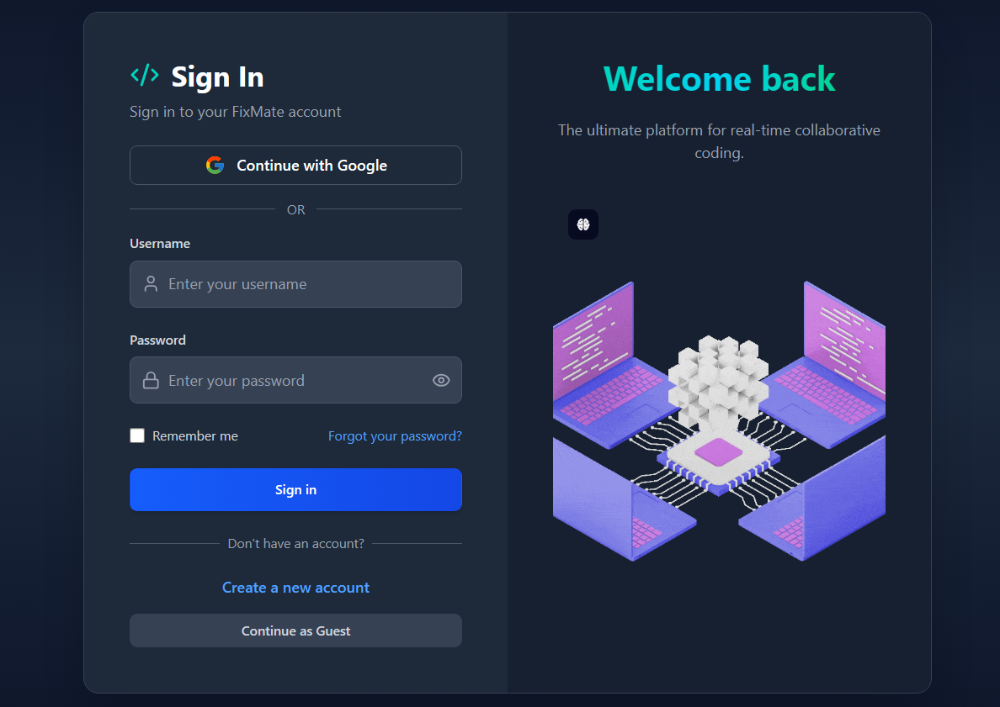
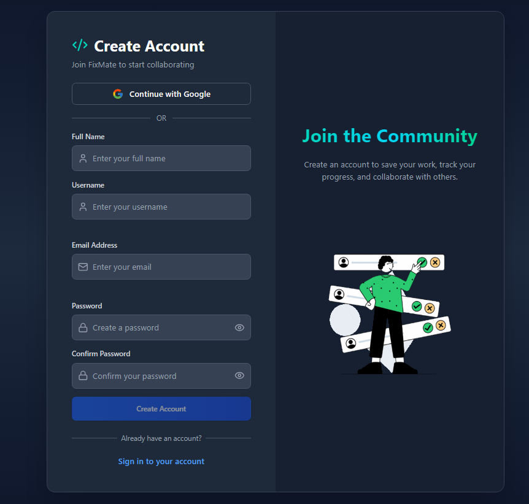
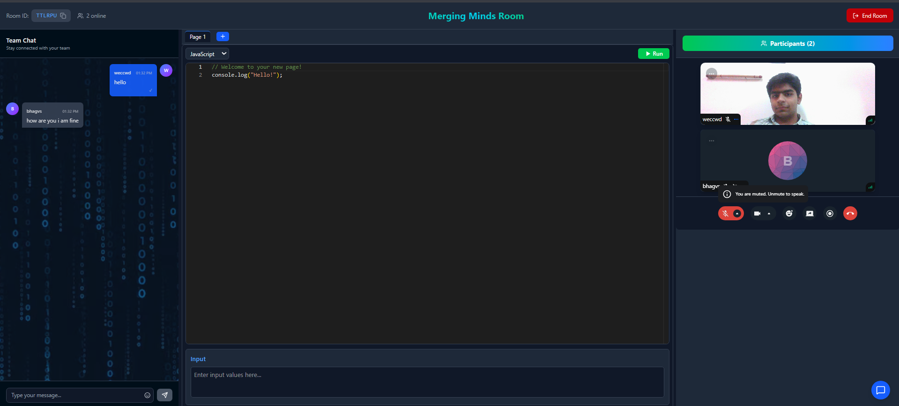
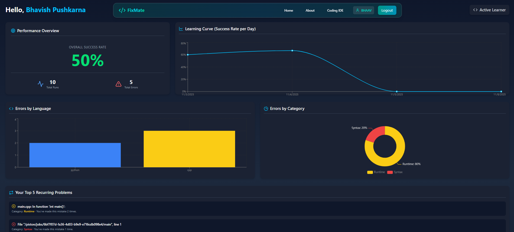
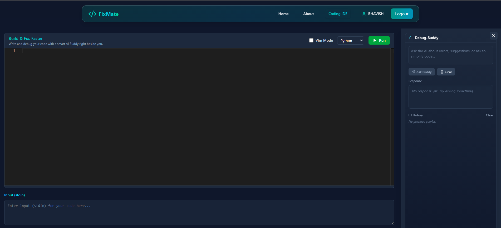

# FixMate - Collaborative Code Editor
**FixMate** is a real-time, feature-rich collaborative code editor designed for pair programming, technical interviews, and remote learning. It provides a seamless environment where developers can code together, communicate via video chat, and even get help from an integrated AI assistant.

This project is built with a modern tech stack, featuring a **React/Vite** frontend and a **Node.js/Express** backend, all tied together with **WebSockets**, **Stream**, and the **Google Gemini API**.

---

## Key Features

* **Real-time Collaborative Editing:** Powered by **Socket.io**, multiple users can edit the same file simultaneously, with changes reflected instantly.
* **Integrated Video & Chat:** High-quality video and text chat panels using **Stream**, allowing for face-to-face communication right inside the editor.
* **AI-Powered Debug-Buddy:** Stuck on a bug? An integrated **Google Gemini** assistant can explain errors, suggest fixes, or refactor code.
* **Instant Code Execution:** Run your code instantly using the **Piston API** for various languages, with output displayed directly in the editor.
* **Secure Authentication:** Full user auth system with **JWT**, `httpOnly` cookies, Google OAuth 2.0 (via Firebase), and secure password reset functionality (via Nodemailer).
* **Personal Dashboard:** A protected route for logged-in users to view their coding activity, success/error rates, and most common mistakes, visualized with charts.
* **Vim Mode:** Optional Vim keybindings within the Monaco editor for power users.
* **Modern UI:** A sleek, responsive, and dark-mode-first UI built with **TailwindCSS** and **Framer Motion**.

---

## Screenshots
### Login Page

### Registration Page

### Video Panel

### Dashboard

### AI-Powered Error Resolver IDE


---

## Tech Stack

| Area | Technology |
| :--- | :--- |
| **Frontend** | React 19, Vite, TailwindCSS, Framer Motion, Socket.io Client, Monaco Editor, Stream.io React SDK, Firebase (Auth) |
| **Backend** | Node.js, Express.js, MongoDB, Mongoose, Socket.io, Firebase Admin, JSON Web Tokens (JWT), Google Generative AI (Gemini), Stream.io Node SDK, Nodemailer |
| **Database** | MongoDB Atlas |
| **Services** | Stream (Video/Chat), Piston API (Code Execution), Google Gemini (AI) |

---

## Getting Started

To get a local copy up and running, follow these simple steps.

### Prerequisites

* Node.js (v18.0.0 or higher)
* npm
* A MongoDB Atlas account (or local MongoDB instance)
* A Firebase project for Google Authentication
* A Stream.io account for video/chat
* A Google Gemini API key

### 1. Backend Setup

First, set up the server which handles WebSockets, API requests, and AI integration.

1.  **Navigate to the backend directory:**
    ```sh
    cd new/codeeditor-backend
    ```

2.  **Install NPM packages:**
    ```sh
    npm install
    ```

3.  **Create your environment file:**
    Create a `.env` file in the `new/codeeditor-backend` directory and add the following variables. Get these keys from their respective service dashboards.

    ```ini
    # See .env.example for a full list
    NODE_ENV=development
    PORT=4000
    
    # Your MongoDB Connection String
    MONGO_URI="mongodb+srv://<user>:<password>@cluster0.qibql0d.mongodb.net"
    
    # JWT Secrets (replace with long, random strings)
    JWT_SECRET="YOUR_JWT_SECRET_KEY"
    JWT_REFRESH_SECRET="YOUR_JWT_REFRESH_KEY"
    
    # Stream.io API Keys
    STREAM_API_KEY=your_stream_api_key
    STREAM_API_SECRET=your_stream_api_secret
    
    # Google Gemini API Key
    GEMINI_API_KEY=your_gemini_api_key
    
    # Nodemailer (for Password Reset)
    # Use an "App Password" if using Gmail
    EMAIL_USER=your_email@gmail.com
    EMAIL_PASS=your_gmail_app_password 
    
    # Frontend URL (for CORS and password reset links)
    FRONTEND_URL=http://localhost:5173
    ```

4.  **Add Firebase Credentials:**
    * Go to your Firebase project settings > Service accounts.
    * Generate a new private key and download the JSON file.
    * Rename this file to `firebase-credentials.json` and place it in the `new/codeeditor-backend` directory.

5.  **Run the backend server:**
    ```sh
    npm run dev
    ```
    Your backend server should now be running on `http://localhost:4000`.

### 2. Frontend Setup

Next, set up the React client.

1.  **Navigate to the frontend directory:**
    ```sh
    cd new/CollabrativeCodeEditor
    ```

2.  **Install NPM packages:**
    ```sh
    npm install
    ```

3.  **Create your environment file:**
    Create a `.env` file in the `new/CollabrativeCodeEditor` directory:
    ```ini
    BACKEND_URL="http://localhost:4000"
    ```

4.  **Configure Firebase:**
    * Open `src/firebase.js`.
    * Go to your Firebase project settings > General.
    * Find your "Web App" config.
    * Copy the `firebaseConfig` object and paste it into `src/firebase.js`, replacing the existing placeholder keys.

5.  **Run the frontend client:**
    ```sh
    npm run dev
    ```
    Your React app should now be running on `http://localhost:5173`.

### 3. You're All Set!

Open `http://localhost:5173` in your browser. You can now register an account, create a room, and invite others (by sending them the room link) to your local instance!

---

## License

Distributed under the GNU GPL License 3.0. See the `package.json` files for more information.
